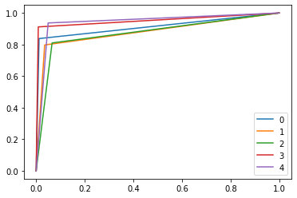
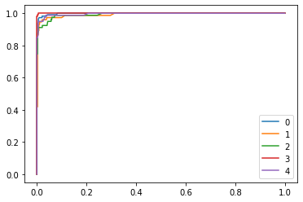
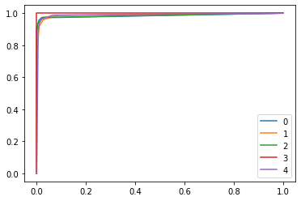

+++
title = "NLP with BBC News - Prediction with Decision trees"
description = "Online and Batch analysis of Gaussian mixtures"
date = 2019-12-19T12:32:00+01:00
weight = 10
draft = false
bref = "Make supervised algorithms"
toc = true
+++

[github]: /github-logo.png


This tutorial shows how to build supervised learning algortihms with 'distclus' on a BBC articles dataset. The goal is to compare the efficiency of several machine learning algorithms to classify BBC news articles into 5 different category : business, entertainment, politics, sport and tech.

The dataset can be found at : http://mlg.ucd.ie/datasets/bbc.html

## Extracting data and embedding

First, we need to open the BBC data.


```python
from os import listdir

folders = ['business','entertainment','politics','sport','tech']

dataset = []#list of 2-uplet (article body,class)
for topic in folders:
    file_list = [f for f in listdir('bbc/'+topic) if f[0]!='.']
    #print(file_list)
    for filename in file_list:
        with open('bbc/'+topic+'/'+filename, encoding='ISO-8859-1') as f:
            #print(topic,filename)
            contain = f.readlines()
            result = ''
            for elt in contain:
                if elt != '\n':
                    result+= elt[:-1]+' '
        dataset.append((result,topic))
print(dataset[0])
```

    ('JP Morgan admits US slavery links Thousands of slaves were accepted as collateral for loans by two banks that later became part of JP Morgan Chase. The admission is part of an apology sent to JP Morgan staff after the bank researched its links to slavery in order to meet legislation in Chicago. Citizens Bank and Canal Bank are the two lenders that were identified. They are now closed, but were linked to Bank One, which JP Morgan bought last year. About 13,000 slaves were used as loan collateral between 1831 and 1865. Because of defaults by plantation owners, Citizens and Canal ended up owning about 1,250 slaves. "We all know slavery existed in our country, but it is quite different to see how our history and the institution of slavery were intertwined," JP Morgan chief executive William Harrison and chief operating officer James Dimon said in the letter. "Slavery was tragically ingrained in American society, but that is no excuse." "We apologise to the African-American community, particularly those who are descendants of slaves, and to the rest of the American public for the role that Citizens Bank and Canal Bank played." "The slavery era was a tragic time in US history and in our company\'s history." JP Morgan said that it was setting up a $5m scholarship programme for students living in Louisiana, the state where the events took place. The bank said that it is a "very different company than the Citizens and Canal Banks of the 1800s". ', 'business')


To be able to test our machine learning algorithms, we need to separate the data into training and testing data.


```python
import numpy as np, psutil

import random

x = 80     # percentage for trainset

random.shuffle(dataset)

n = len(dataset)
n_train = int(x*n/100)

trainset = dataset[:n_train]
testset = dataset[n_train:]

n_test = len(testset)

print(len(trainset),'articles in the train over',n,'articles')
```

    1780 articles in the train over 2225 articles


We create a csv file to open it with fastext


```python
import fasttext
import os

### For the trainset ###

cpt=0
outfile_train = 'train_bbc'+str(x)+'%'+'.csv' # Creating an output file for the train set to use it 
f = open(outfile_train,'w')

for article in trainset:
    line = article[0]
    f.write(line+'\n')
    cpt+=1
print(outfile_train,'created with',cpt,'lines')
f.close()

### Now for the testset ###

cpt=0
outfile_test = 'test_bbc'+str(x)+'%'+'.csv'
f = open(outfile_test,'w')

for article in testset:
    line = article[0]
    f.write(line+'\n')
    cpt+=1
print(outfile_test,'created with',cpt,'lines')
f.close()

### Bash part to preprocess data (mainly avoiding punctuation) ###

os.system(f"""cat {outfile_train} | sed -e "s/\([.\!?,'/()]\)/ \1 /g" | tr "[:upper:]" "[:lower:]" > bbc_train.csv""")
os.system(f"""cat {outfile_test} | sed -e "s/\([.\!?,'/()]\)/ \1 /g" | tr "[:upper:]" "[:lower:]" > bbc_test.csv""")
```

    train_bbc80%.csv created with 1780 lines
    test_bbc80%.csv created with 445 lines


    0


To be able to use the articles data, we have to use embedding with fasttext.


```python
# Training an embedding model
d = 30
model = fasttext.train_unsupervised(outfile_train, model='skipgram',dim=d)
model.save_model("model_"+outfile_train+".bin")

# Using this model to modify the raw data
def vectorize(body):
    list_words =body.split()
    vect = np.zeros((1,d))
    for w in list_words:
        vect += model[w]
    return(vect)

with open(outfile_train) as f:
    list_vectors = [vectorize(line) for line in f]        # create a list of embeddings for the trainset

train_vectors = np.array(list_vectors).reshape(n_train,-1)

with open(outfile_test) as f:
    list_vectors = [vectorize(line) for line in f]        # create a list of embeddings for the testset

test_vectors = np.array(list_vectors).reshape(n_test,-1)
```

The labels have to be one hot encoded.


```python
from sklearn.preprocessing import OneHotEncoder

one_hot_encoder = OneHotEncoder(sparse=False)

### Trainset ###

Y_train = np.array(trainset)
temp = []
for k in range(n_train) :
    temp.append(Y_train[k][1])
Y_train = temp

values = np.array(Y_train)
Y_train = one_hot_encoder.fit_transform(values.reshape(-1, 1))

### Testset ###

Y_test = np.array(testset)
temp = []
for k in range(n_test) :
    temp.append(Y_test[k][1])
Y_test = temp

values = np.array(Y_test)
Y_test = one_hot_encoder.fit_transform(values.reshape(-1, 1))

### Just renaming our embeddings ###

X_train = train_vectors
X_test = test_vectors
```

## Using machine learning to predict the labels of articles

Now that we have the articles data in a usable format, we can use them to train and test our algorithms.

### CART

First, we will test the CART algorithm. The following code creates the CART classifier and trains it with our data.


```python
from sklearn.tree import DecisionTreeClassifier

dtc = DecisionTreeClassifier()
dtc.fit(X_train, Y_train)
```


    DecisionTreeClassifier(ccp_alpha=0.0, class_weight=None, criterion='gini',
                           max_depth=None, max_features=None, max_leaf_nodes=None,
                           min_impurity_decrease=0.0, min_impurity_split=None,
                           min_samples_leaf=1, min_samples_split=2,
                           min_weight_fraction_leaf=0.0, presort='deprecated',
                           random_state=None, splitter='best')


We have to evaluate our model. We will use 3 different metrics for each model : the accuracy score, the ROC curves and the AUC. ROC curves and AUC are computed for each classes, that's why there are 5 curves each time.


```python
import matplotlib.pyplot as plt

from sklearn.metrics import roc_curve
from sklearn.metrics import roc_auc_score

n_classes = np.shape(Y_test[0])[0]
y_score = dtc.predict_proba(X_test)

fpr0, tpr0, threshs0 = roc_curve(Y_test[:,0],y_score[0][:,1])
fpr1, tpr1, threshs1 = roc_curve(Y_test[:,1],y_score[1][:,1])
fpr2, tpr2, threshs2 = roc_curve(Y_test[:,2],y_score[2][:,1])
fpr3, tpr3, threshs3 = roc_curve(Y_test[:,3],y_score[3][:,1])
fpr4, tpr4, threshs4 = roc_curve(Y_test[:,4],y_score[4][:,1])
plt.plot(fpr0,tpr0,label="0")
plt.plot(fpr1,tpr1,label="1")
plt.plot(fpr2,tpr2,label="2")
plt.plot(fpr3,tpr3,label="3")
plt.plot(fpr4,tpr4,label="4")
plt.legend(loc="lower right")

print("score :",dtc.score(X_test,Y_test))
print("")
print("auc for each classes :")
print("0 :",roc_auc_score(Y_test[:,0],y_score[0][:,1]))
print("1 :",roc_auc_score(Y_test[:,1],y_score[1][:,1]))
print("2 :",roc_auc_score(Y_test[:,2],y_score[2][:,1]))
print("3 :",roc_auc_score(Y_test[:,3],y_score[3][:,1]))
print("4 :",roc_auc_score(Y_test[:,4],y_score[4][:,1]))
```

    score : 0.8606741573033708
    
    auc for each classes :
    0 : 0.9129308949668231
    1 : 0.8811284330152255
    2 : 0.8722764058933388
    3 : 0.9515091750986109
    4 : 0.9437642664453205





### Random Forest

Our second algorithm to test is the random forest. Training the random forest :


```python
from sklearn.ensemble import RandomForestClassifier

clf = RandomForestClassifier(max_depth=20, random_state=0, n_estimators=200)
clf.fit(X_train, Y_train)
```


    RandomForestClassifier(bootstrap=True, ccp_alpha=0.0, class_weight=None,
                           criterion='gini', max_depth=20, max_features='auto',
                           max_leaf_nodes=None, max_samples=None,
                           min_impurity_decrease=0.0, min_impurity_split=None,
                           min_samples_leaf=1, min_samples_split=2,
                           min_weight_fraction_leaf=0.0, n_estimators=200,
                           n_jobs=None, oob_score=False, random_state=0, verbose=0,
                           warm_start=False)


Its evaluation gives us those results :


```python
n_classes = np.shape(Y_test[0])[0]
y_score = clf.predict_proba(X_test)

fpr0, tpr0, threshs0 = roc_curve(Y_test[:,0],y_score[0][:,1])
fpr1, tpr1, threshs1 = roc_curve(Y_test[:,1],y_score[1][:,1])
fpr2, tpr2, threshs2 = roc_curve(Y_test[:,2],y_score[2][:,1])
fpr3, tpr3, threshs3 = roc_curve(Y_test[:,3],y_score[3][:,1])
fpr4, tpr4, threshs4 = roc_curve(Y_test[:,4],y_score[4][:,1])
plt.plot(fpr0,tpr0,label="0")
plt.plot(fpr1,tpr1,label="1")
plt.plot(fpr2,tpr2,label="2")
plt.plot(fpr3,tpr3,label="3")
plt.plot(fpr4,tpr4,label="4")
plt.legend(loc="lower right")

print("score :",clf.score(X_test,Y_test))
print("")
print("auc for each classes :")
print("0 :",roc_auc_score(Y_test[:,0],y_score[0][:,1]))
print("1 :",roc_auc_score(Y_test[:,1],y_score[1][:,1]))
print("2 :",roc_auc_score(Y_test[:,2],y_score[2][:,1]))
print("3 :",roc_auc_score(Y_test[:,3],y_score[3][:,1]))
print("4 :",roc_auc_score(Y_test[:,4],y_score[4][:,1]))
```

    score : 0.9101123595505618
    
    auc for each classes :
    0 : 0.9982332632033231
    1 : 0.9918226852189116
    2 : 0.9925295704503009
    3 : 0.9999142514148517
    4 : 0.9958151760392889





It is clearly better than the CART algorithm.

### KNN

KNN algortihm comes next.


```python
from sklearn.neighbors import KNeighborsClassifier

knn = KNeighborsClassifier()
knn.fit(X_train, Y_train)
```


    KNeighborsClassifier(algorithm='auto', leaf_size=30, metric='minkowski',
                         metric_params=None, n_jobs=None, n_neighbors=5, p=2,
                         weights='uniform')


Here is its evaluation :


```python
n_classes = np.shape(Y_test[0])[0]
y_score = knn.predict_proba(X_test)

fpr0, tpr0, threshs0 = roc_curve(Y_test[:,0],y_score[0][:,1])
fpr1, tpr1, threshs1 = roc_curve(Y_test[:,1],y_score[1][:,1])
fpr2, tpr2, threshs2 = roc_curve(Y_test[:,2],y_score[2][:,1])
fpr3, tpr3, threshs3 = roc_curve(Y_test[:,3],y_score[3][:,1])
fpr4, tpr4, threshs4 = roc_curve(Y_test[:,4],y_score[4][:,1])
plt.plot(fpr0,tpr0,label="0")
plt.plot(fpr1,tpr1,label="1")
plt.plot(fpr2,tpr2,label="2")
plt.plot(fpr3,tpr3,label="3")
plt.plot(fpr4,tpr4,label="4")
plt.legend(loc="lower right")

print("score :",knn.score(X_test,Y_test))
print("")
print("auc for each classes :")
print("0 :",roc_auc_score(Y_test[:,0],y_score[0][:,1]))
print("1 :",roc_auc_score(Y_test[:,1],y_score[1][:,1]))
print("2 :",roc_auc_score(Y_test[:,2],y_score[2][:,1]))
print("3 :",roc_auc_score(Y_test[:,3],y_score[3][:,1]))
print("4 :",roc_auc_score(Y_test[:,4],y_score[4][:,1]))
```

    score : 0.950561797752809
    
    auc for each classes :
    0 : 0.9850434266601932
    1 : 0.988307714722809
    2 : 0.9856470913744206
    3 : 1.0
    4 : 0.9886905997094833





### KNC (K-Nearest-Cluster)

Last but not least, we will test an algorithm that uses MCMC clustering from the distclus library. The goal is to first create clusters with the BBC news data.


```python
from distclus import Batch, MCMC

print('Analyzing',n_train,'articles---')
algo = Batch(MCMC, init_k=5, b=1.,frame_size=n,amp=5,max_k = 10,mcmc_iter=5)
algo.run()
algo.push(X_train)
print(len(algo.centroids),'centers')
```

    Analyzing 1780 articles---
    5 centers


Then we use the KNN algorithm to find the nearest cluster by computing the distance between the test data and the centroid of the cluster.


```python
clust_pred = algo.predict(X_train)

Affiliated_cluster = []

for k in range(len(Y_test)) :
    
    point = X_test[k]
    temp = [  np.linalg.norm(point-centroid) for centroid in algo.centroids ]
    Affiliated_cluster.append(temp.index(min(temp)))
```


```python
clusters_labels = [[] for k in range(len(algo.centroids))]
clusters_X = [[] for k in range(len(algo.centroids))]

for k in range(len(clust_pred)) :
    
    clust_affilie = clust_pred[k]
    clusters_labels[clust_affilie].append(Y_train[k])
    clusters_X[clust_affilie].append(X_train[k])
```

For each cluster, we train a KNN algorithm that will help us to find the best class for each test data affiliated to this cluster.


```python
knn_per_cluster = []

for k in range(len(algo.centroids)) :
    
    knn = KNeighborsClassifier(n_neighbors=5)
    knn.fit(clusters_X[k],clusters_labels[k])
    knn_per_cluster.append(knn)
```

We create the vector Y_pred, which contains the predicted results for each test data.


```python
Y_pred = []

for k in range(len(X_test)) :
    
    curr_cluster = Affiliated_cluster[k]
    pred = knn_per_cluster[curr_cluster].predict(X_test[k].reshape(1,-1))
    pred = pred.reshape(5)
    Y_pred.append(pred)
```

To compute the metrics for this model, we compute the roc curves for each KNN algorithm and average them. This can give us an idea of the quality of our model.


```python
from sklearn.metrics import accuracy_score

n_classes = np.shape(Y_test[0])[0]
Y_score = []

for knn in knn_per_cluster:
    Y_score.append(knn.predict_proba(X_test))

y_sum = []
for y_score in Y_score:
    y_sum += [x / len(Y_score) for x in y_score]
y_score = y_sum
    
fpr0, tpr0, threshs0 = roc_curve(Y_test[:,0],y_score[0][:,1])
fpr1, tpr1, threshs1 = roc_curve(Y_test[:,1],y_score[1][:,1])
fpr2, tpr2, threshs2 = roc_curve(Y_test[:,2],y_score[2][:,1])
fpr3, tpr3, threshs3 = roc_curve(Y_test[:,3],y_score[3][:,1])
fpr4, tpr4, threshs4 = roc_curve(Y_test[:,4],y_score[4][:,1])
plt.plot(fpr0,tpr0,label="0")
plt.plot(fpr1,tpr1,label="1")
plt.plot(fpr2,tpr2,label="2")
plt.plot(fpr3,tpr3,label="3")
plt.plot(fpr4,tpr4,label="4")
plt.legend(loc="lower right")

print("score :",accuracy_score(Y_test, Y_pred))
print("")
print("auc for each classes :")
print("0 :",roc_auc_score(Y_test[:,0],y_score[0][:,1]))
print("1 :",roc_auc_score(Y_test[:,1],y_score[1][:,1]))
print("2 :",roc_auc_score(Y_test[:,2],y_score[2][:,1]))
print("3 :",roc_auc_score(Y_test[:,3],y_score[3][:,1]))
print("4 :",roc_auc_score(Y_test[:,4],y_score[4][:,1]))
```

    score : 0.9438202247191011
    
    auc for each classes :
    0 : 0.8003317688946431
    1 : 0.9572011364464195
    2 : 0.9680604551428373
    3 : 0.9837649345452467
    4 : 0.9432800719374698


